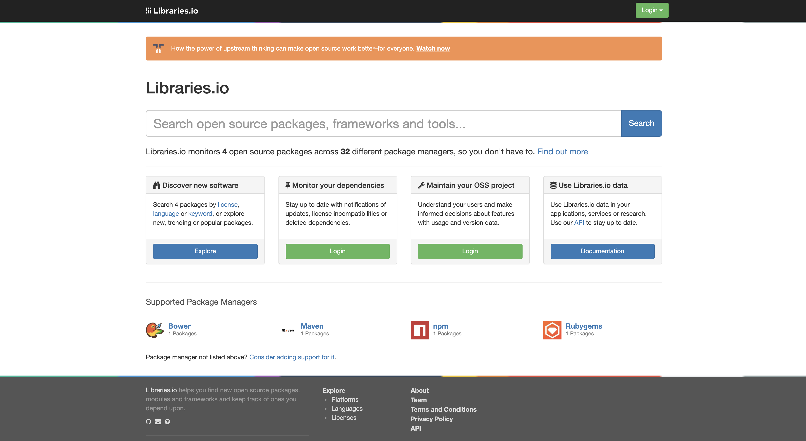

# Steps to get Libraries.io up and running

## Manual setup
> These following steps are taking in the effort of getting the Libraries.io dev enviornment up and runnning on Kasper's machine. A 2019 i7 MacBook Pro running macOS Big Sur 11.6

https://github.com/librariesio/libraries.io/blob/main/docs/development-setup.md

Start time: *2021-09-22 21.24 CEST*

1) git clone git@github.com:librariesio/libraries.io.git
2) cd libraries.io
3) `brew install rbenv ruby-build`
4) `rbenv install 2.6.5`
5) `brew install --cask phantomjs homebrew/cask-versions/adoptopenjdk8`
6) `brew install postgres redis icu4c cmake`
7) `brew services start redis`
8) `brew services start postgresql`
9) Now trying to get ElasticSearch up and running. Downloaded ES version from link in guide.
10) Since I obtained ES from ZIP, I run it from bin/elasticsearch. This failed with error `ERR: Unrecognized VM option 'UseParNewGC'`. Gave up after debugging different jdk versions without any luck. Moving on.
11) Since I will run postgres from a Docker-container, config/database.yml need to be updated with values from docker-compose.yml
    - let database.yml:development.username = <%= ENV["PG_USERNAME"] || "librariesio" %>
    - let database.yml:development.password = not-a-secret
    - let database.yml:development.host = localhost (variable uncommented and set)
    - let database.yml:development.port = 5432 (variable uncommented and set)
12) The guide states that the user may need to create a superuser in the postgres container
    - I didn't succeed. When logged into the container using `docker exec -it xxx /bin/sh`, I get denied, since the user is `root`. `ERR: "root" execution of the PostgreSQL server is not permitted.`
13) `gem install bundler`
    -  `ERR: You don't have write permissions for the /Library/Ruby/Gems/2.6.0 directory.`
14) `sudo gem install bundler`
15) `rbenv rehash`
16) `bundle exec rake db:create db:migrate`
    - `ERR: Your Ruby version is 2.6.3, but your Gemfile specified 2.6.5`
17) Followed this guide from SO https://stackoverflow.com/a/68123451/9110800
    1)  `rbenv init`
    2)  `echo 'eval "$(rbenv init -)"' >> ~/.zshrc`
    3)  `rbenv local 2.6.5`
    4)  `ruby -v ` 
        1)  `ruby 2.6.5p114 (2019-10-01 revision 67812) [x86_64-darwin20]` - success!
18) Then `bundle exec rake db:create db:migrate` again
    1)  `ERR: Could not find rake-13.0.3 in any of the sources. Run 'bundle install' to install missing gems.`
19) `bundle install` (Ran for 5 minutes or more)
20) `bundle exec rake db:create db:migrate` - again again
    1)  `ERR: FATAL:  role "librariesio" does not exist. Couldn't create 'libraries_development' database. Please check your configuration.
rake aborted!`
21) I give up for now. Moving on to Docker.

End time: *2021-09-22 22.47 CEST*

## Manual setup part 2

1) git clone git@github.com:librariesio/libraries.io.git
2) cd libraries.io
3) `brew install rbenv ruby-build`
4) `rbenv install 2.6.5`
5) `brew install --cask phantomjs homebrew/cask-versions/adoptopenjdk8`
6) `brew install postgres redis icu4c cmake`
7) `brew services start redis`
8) `brew services start postgresql`
9) Now trying to get ElasticSearch up and running. Downloaded ES version from link in guide.
10) Since I obtained ES from ZIP, I run it from bin/elasticsearch. This failed with error `ERR: Unrecognized VM option 'UseParNewGC'`. 
    1)  Had to downgrade to Java version 8. Followed this https://stackoverflow.com/a/46517346/9110800.
    2)  Now ES has to be run from binary file from Finder. Could set up PATH to ES sources.
11) Now, create user in Postgres DB.
    1)  `psql postgres`
    2)  `create user librariesio;`
12) `gem install bundler`
13) `rbenv rehash`
14) `bundle install`
15) `bundle exec rake db:create db:migrate`
16) Created GitHub access token with name Libraries.io. Placed as viariable in `.zshrc` with name `LIBRARIESIO_GH_TOKEN`. [Link to guide](https://github.com/librariesio/libraries.io/blob/main/docs/development-setup.md#github-authentication-and-connection)
    1)  To obtain: `echo $LIBRARIESIO_GH_TOKEN`
17)
    ```bash
    bundle exec rails c
    irb> AuthToken.create(token: "<secure github token here>")
    irb> PackageManager::NPM.update "pictogram"
    irb> PackageManager::Rubygems.update "split"
    irb> PackageManager::Bower.update "sbteclipse"
    irb> PackageManager::Maven.update "junit:junit"
    irb> Repository.create_from_host("github", "librariesio/bibliothecary")
    ```
18) These returned some Postgres Errors
    1)  Fixed by running query `REFRESH MATERIALIZED VIEW public.project_dependent_repositories WITH DATA;` inside Postgres. [Source](https://github.com/librariesio/libraries.io/issues/2835)
19) Redo step 17. (Prev. step)
20) `rake search:reindex_everything` from standard commandline
    1)  Some index errors from ES. Completely normal (!?)
21) `bundle exec rails s` to run server - serves at http://locahost:3000
22) KÆMPE OPTUR!



### How to run it afterwards
1) Fire up `elsaticsearch` from `/Applications/elasticsearch-2.4.5/bin`
   1) Make sure java8 is set as $JAVA_HOME, set with `java8`
2) `cd ~/src/libraries.io`
3) `bundle exec rails s`

## Docker setup
> No Docker guide is provided, so it has been trial and error
Start time: *2021-09-22 22.58 CEST*

1) `docker build . -t librariesio/app`
   1) Not really useful image produced
2) `docker compose up`
3) Go to `http://localhost:3000`
   1) `ERR: ActiveRecord::PendingMigrationError. Migrations are pending. To resolve this issue, run: bin/rails db:migrate RAILS_ENV=development`
4) `docker exec -it xxx /bin/sh`
   1) `bin/rails db:migrate RAILS_ENV=development`
   2) `== 20210324133104 AddIndexToVersionsUpdatedAt: migrated (0.0048s) =============`
5) Go back to browser and refresh
   1) `ERR: Elasticsearch::Transport::Transport::Errors::NotFound in ProjectsController#index`
 ```json
    {
        "error": {
            "root_cause":[
                {
                    "type": "index_not_found_exception",
                    "reason":" no such index",
                    "resource.type": "index_or_alias",
                    "resource.id": "projects-development",
                    "index": "projects-development"
                }
            ],
            "type": "index_not_found_exception",
            "reason": "no such index",
            "resource.type": "index_or_alias",
            "resource.id": "projects-development",
            "index": "projects-development"
        },
        "status":404
    }
 ```
6) Dead end...

End time: *2021-09-22 23.28 CEST*